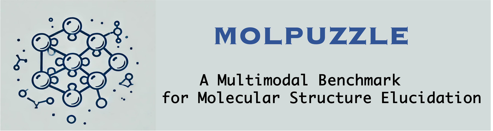

# MolPuzzle: Spectrum Analysis using LLMs



## Overview

MolPuzzle is a comprehensive framework for elucidating molecular structures from spectral data (IR, Mass Spectrometry, H-NMR, C-NMR) using Large Language Models (LLMs). It automates the generation of questions based on spectral features, samples data for evaluation, and benchmarks various models including GPT-4, Claude, and open-source VLM models.

## Features

- **Multi-Modal Analysis**: Supports IR, Mass Spec, H-NMR, and C-NMR spectrum analysis.
- **Automated Question Generation**: Converts spectral data into natural language QA pairs.
- **Model Evaluation**: Benchmarks LLM performance on chemical structure elucidation tasks.
- **Extensible Architecture**: Easy to add new models and datasets.

## Structure

- `src/molpuzzle/`: Core package containing the analysis logic.
- `notebooks/`: Jupyter notebooks for data conversion and experimental workflows.
- `Data/`: Dataset containing JSON and image files for spectrum analysis.
- `sample_data/`: Directory for generated sample data.

## Installation

### Prerequisites

- Python 3.8+
- PyTorch
- CUDA (optional, for local model inference)

### Steps

1. Clone the repository:
   ```bash
   git clone https://github.com/yourusername/MolPuzzle.git
   cd MolPuzzle
   ```

2. Install dependencies:
   ```bash
   pip install -r requirements.txt
   ```
   Or install the package in editable mode:
   ```bash
   pip install -e .
   ```

## Quick Start

We provide a quick start script to demonstrate how to load data and perform sampling.

```bash
python quick_start.py
```

This script will:
1. Load sample data from `Data/Stage1.json`.
2. Convert it to a CSV format suitable for processing.
3. perform a data sampling session to generate a test set.

## Usage

### 1. Data Sampling

To sample questions from a dataset:

```bash
python src/molpuzzle/spectrum_analysis.py \
    --task H-NMR \
    --action sample_data \
    --input_csv sample_data/stage1_sample.csv \
    --output_csv sample_data/sampled_questions.csv
```

### 2. Generate Responses

To generate responses using a model (e.g., GPT-4):

```bash
export OPENAI_API_KEY='your_key'
python src/molpuzzle/spectrum_analysis.py \
    --task H-NMR \
    --action generate_responses \
    --models gpt-4 \
    --input_csv sample_data/sampled_questions_0.csv
```

### 3. Evaluation

To evaluate model performance:

```bash
python src/molpuzzle/spectrum_analysis.py \
    --task H-NMR \
    --action evaluate \
    --models gpt-4 \
    --input_csv sample_data/sampled_questions_0.csv
```

## Data Sample

The `Data/` directory contains the core datasets.
- `Stage1.json`: Basic property questions (Saturation, etc.)
- `Stage2.json`: Functional group identification.
- `Stage3.json`: Full structure elucidation.

Example entry from Stage 1:
```json
{
    "Molecule Index": "99",
    "SMILES": "CCCCC1=CC=CC=C1",
    "cls": "Saturation",
    "Formula": "C10H14",
    "Question": "Could the molecule with the formula C10H14 potentially be Saturated?",
    "Answer": "No"
}
```

## License

This project is licensed under the MIT License - see the [LICENSE](LICENSE) file for details.
